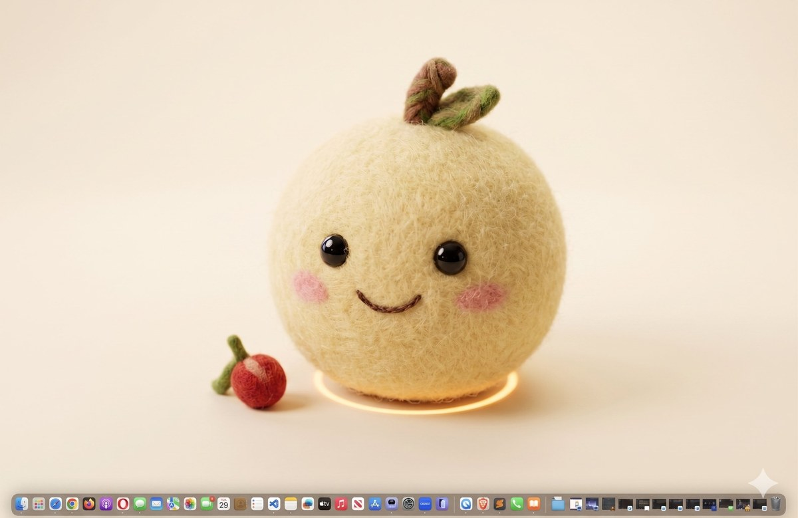

# Brandee

<p align="center">
  
</p>

<p align="center"><em>Your AI desk assistant. Cute on purpose.</em></p>

Brandee is a small AI desk assistant you can talk to. She has a face, opinions, and idle behaviors. Think Clippy if Clippy was actually fun to use.

This is my submission for the candidate project. The brief was to build a viral, character-driven AI assistant in the spirit of Clippy 2.0. The point wasn't just "make a chatbot" — it was to make something people would actually want to share.

Live: https://brandee-production.up.railway.app

## Run it locally

```bash
npm run install:all
cp server/.env.example server/.env
# add your Anthropic API key
# optionally add ELEVENLABS_API_KEY for voice
npm run dev
```

Open http://localhost:5173.

## Stack

- React + Vite
- Plain CSS, no Tailwind, no UI library. Wanted full control over animation
- Express + the Anthropic SDK on the backend
- ElevenLabs for Brandee's voice (server-proxied so the key stays off the client)
- Browser Web Speech API for voice input (free, no key)
- Hand-rolled SVG character

No animation library. CSS keyframes for the idle stuff, React state for one-shot reactions. I wanted to know exactly what was happening on every frame.

## What's in here

Brandee is an SVG character with:

- 7 main states: idle, thinking, speaking, listening, celebrating, error, bored
- 8 idle vignettes that play randomly when you stop interacting: yawning, humming, looking around, watching a butterfly, doodling on a notepad, dancing, stretching, peeking
- Click reactions that escalate the more you poke her: startled, wave, giggle, annoyed
- Eyes that follow your cursor when it's near her
- A mood system where the AI tells her face what to show, so her expression matches what she's saying instead of just what's happening
- A pencil tucked behind her tuft (she's a creative companion)
- Round glasses that appear when honest mode is on (her "I'm being serious" tell)

The whole thing is a state machine. Inputs come from the chat lifecycle, your mouse, an idle director that schedules vignettes, and a mood tag the AI prepends to every response.

## Voice

You can talk to her. She talks back.

Her voice is "Charlotte" from ElevenLabs. Warm, soft, slightly mischievous. Fits her. The server proxies the API so the key never touches the client.

For your voice, I used the browser's native Web Speech API. On top of that I added voice activity detection. Without VAD, the browser auto-finalizes after about half a second of silence, which interrupts you mid-thought. With VAD I measure mic amplitude separately and only stop listening after you've actually been quiet for 1.5 seconds. So you can pause, breathe, think. She waits.

There's a dedicated voice mode (full-screen, big Brandee, big mic button) and a regular text mode with a mic button if you just want to dictate now and then. In voice mode she speaks her replies; in text mode she stays silent (as you'd expect).

## The viral pieces

Two features I added because they're the share-able moments.

**Honest mode.** A toggle that swaps her system prompt to an unfiltered version. Same character, but now she can actually say a tagline sounds generic, or that "disrupt" doesn't belong in your About page. The whole UI shifts when it's on. Her eyes go skeptical, glasses appear on her face, the status pill turns red, suggestion chips become roast prompts. The pitch: "Brandee said my tagline sounds like a dentist's marketing email" is a tweet people would actually write.

**Image intake.** Drag, paste, or upload any image and she gives an opinionated take. Combine with honest mode and you've got the "rate my logo" format that's already going viral on TikTok.

## Layout

Brandee lives in a soft pink sidebar (her own little home) on the left. The workspace on the right is a Ghibli-style watercolor sky — that's where the chat happens. The whole thing reads as one continuous dreamy landscape, not "app with a sidebar." Voice mode takes over the full screen for an immersive call.

## What was hard

Voice took way longer than the rest combined. The basic version worked in an afternoon, then I spent days dealing with edge cases.

ElevenLabs blocked my free-tier key for "unusual activity" because the API was being called from a Railway server. Had to upgrade to Starter to get past it.

Safari refuses to autoplay audio after any delay between gesture and play. I had to add a silent audio unlock on the first user click to prime it.

Chrome's React 18 batching caused intermittent dropouts where some responses just never triggered the TTS call. Took a console screenshot to spot it. Fixed by tracking the response text in a local variable instead of trying to read it back out of React state right after a `setState`.

Going through that and getting it reliable was the most useful part of the project for me. Bug stories beat feature lists.

## What I'd build next

- Real lip sync via phoneme analysis instead of the current keyframe-based mouth animation
- "Save this take" button that captures her face + response as a PNG you can drop in a group chat
- A daily hot take she opens with on first load each day, so people come back for the joke
- Procedural variation in vignettes so the butterfly path, doodle shape, and dance moves change each time
- Memory across sessions so she remembers things you've worked on before
- More tests on the state machine. Right now only the mood parser is covered

## Folder layout

```
brandee/
  brandee-hero.jpg     The felted Brandee photo at the top of this README
  server/              Express, /api/chat/stream, /api/tts, /api/voice/config
  client/
    public/
      favicon.png      The same Brandee photo, cropped to a square for the tab icon
    src/
      App.jsx               composition + state machine
      components/           BrandeeAvatar, Sidebar, ChatColumn, VoiceMode,
                            SettingsPanel, SkyBackdrop
      hooks/                useIdleBehaviors, useCursorGaze, useOnboarding,
                            useTextToSpeech, useSpeechRecognition
      assets/               sky-backdrop.jpg, brandee-hero.jpg, brandee-favicon.png
      styles.css            all styles + animation keyframes
```

## Deploy

I deployed to Railway. Push to GitHub, connect the repo, set `ANTHROPIC_API_KEY` (and optionally `ELEVENLABS_API_KEY`), generate a public domain. The `railway.toml` in the repo handles the build config.

Don't commit `server/.env`. It's in `.gitignore` for a reason. If you do, rotate the key immediately at console.anthropic.com.

## Notes

- Default model is `claude-sonnet-4-5`. Change with `ANTHROPIC_MODEL` env var
- Settings live in localStorage. Clearing it resets her name, color, and re-triggers the onboarding wave
- Keyboard shortcut: Cmd/Ctrl+K focuses the chat input
- If you want to see the onboarding moment again, clear `brandee_onboarded_v1` from localStorage
- Voice gracefully degrades. If `ELEVENLABS_API_KEY` isn't set, the rest of the app works fine and you'll see a small note in voice mode telling you what's missing
